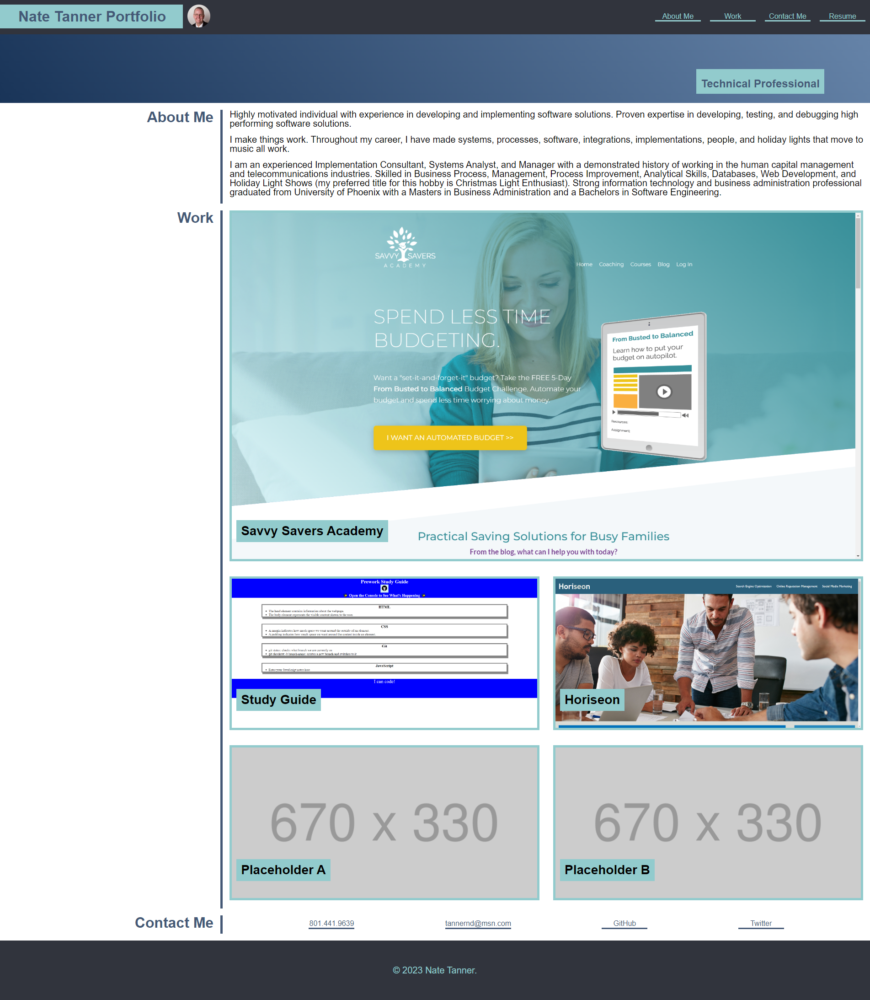
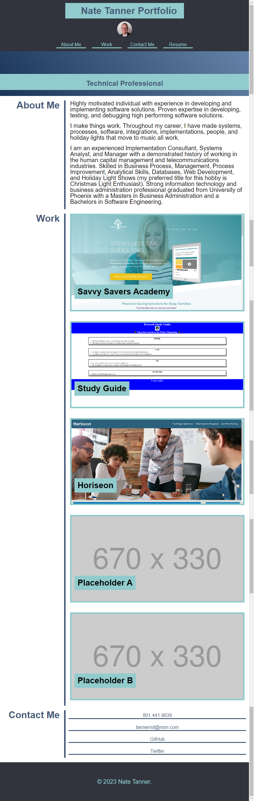
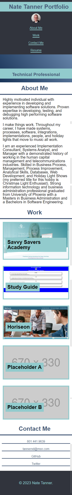

# Mod-2-Challenge

## Description

This project requires the building of a portolio page.  Styling was used to make some "animated" navigation links.  Also, hovering over image links will change the appreance of the image to a sepia tone. Lastly, comments were added for easier developer reading. 

## Installation

N/A - Project is deployed to https://tannernd.github.io/Mod-2-Challenge/

## Usage

The following images show the web application's appearance and functionality on multiple screen sizes:

### Desktop

### Tablet

### Mobile

## Credits

Placeholder images used with permission of https://placehold.jp.
Reset.css file was used.

## License

N/A